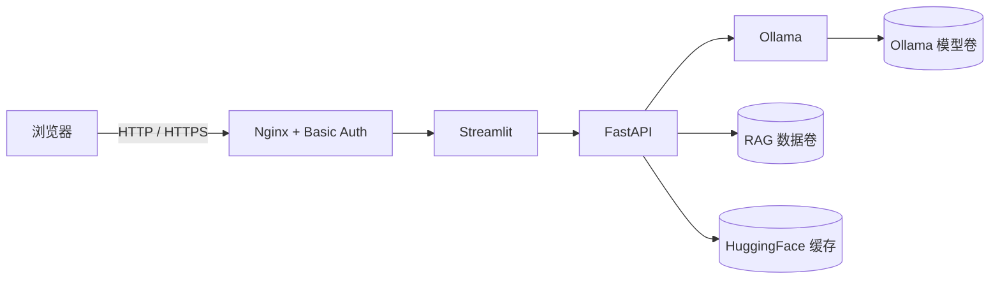

# 部署与发布

本项目的生产拓扑只公开 Nginx。Streamlit、FastAPI 与 Ollama 均位于 Compose 内部网络，
浏览器不能直接访问管理 API 或 Ollama 端口。



## 前置条件

- Docker Engine 24+ 与 Docker Compose v2.20+。
- CPU 模式建议至少 8 GB 内存；`qwen2.5:3b` 建议 12 GB 以上。
- NVIDIA GPU 模式需要主机已安装驱动与 NVIDIA Container Toolkit。
- 公网部署需要域名、HTTPS 终止层和仅开放 80/443 的防火墙。

## 首次启动

Windows PowerShell：

```powershell
.\deploy\start.ps1 start
```

Linux：

```bash
sh deploy/start.sh start
```

脚本会从 `.env.production.example` 创建 `.env.production`，并要求输入不少于 12 位的
访问密码。密码只写入被 Git 忽略的 `deploy/secrets/auth_password`，Nginx 启动时将其转换为
bcrypt htpasswd。默认用户名为 `admin`，默认入口为 <http://127.0.0.1:8080>。

如需手动启动：

```bash
cp .env.production.example .env.production
mkdir -p deploy/secrets
printf '%s' 'replace-with-a-strong-password' > deploy/secrets/auth_password
docker compose --env-file .env.production up -d --build
```

第一次启动会构建 Python 镜像、拉取 Ollama 镜像和 `OLLAMA_CHAT_MODEL`，并下载本地
Embedding 模型。根据网络和磁盘性能可能需要数分钟。

## 端口与公网入口

`.env.production` 可以增加以下 Compose 参数：

```env
RAG_AUTH_USER=admin
RAG_BIND_ADDRESS=127.0.0.1
RAG_HTTP_PORT=8080
RAG_MAX_BODY_SIZE=64m
```

默认只绑定回环地址，适合由宿主机 Nginx、Caddy、Cloudflare Tunnel 或 Tailscale 继续提供
HTTPS。公网服务器不要把 `8000`、`8501` 或 `11434` 暴露出来。

域名反向代理需要支持 WebSocket，并将请求转发到 `http://127.0.0.1:8080`。以宿主机
Nginx 为例：

```nginx
location / {
    proxy_pass http://127.0.0.1:8080;
    proxy_http_version 1.1;
    proxy_set_header Host $host;
    proxy_set_header X-Forwarded-Proto $scheme;
    proxy_set_header Upgrade $http_upgrade;
    proxy_set_header Connection "upgrade";
    proxy_read_timeout 660s;
}
```

TLS 证书建议使用 Certbot 或 Caddy 自动签发。Basic Auth 只能保护应用入口，HTTP 明文传输时
密码仍可能被窃听，因此公网部署必须启用 HTTPS。

## NVIDIA GPU

```bash
docker compose \
  --env-file .env.production \
  -f docker-compose.yml \
  -f docker-compose.gpu.yml \
  up -d --build
```

macOS 的 Docker 容器不能直接使用 Apple GPU。此时可在宿主机运行 Ollama，并按平台配置
`host.docker.internal`，或接受容器内 CPU 推理。

## 运维

```bash
# 状态
docker compose --env-file .env.production ps

# 日志
docker compose --env-file .env.production logs -f --tail 200

# 停止，但保留数据卷
docker compose --env-file .env.production down

# 升级并重建
git pull --ff-only
docker compose --env-file .env.production up -d --build
```

健康检查：

```bash
curl http://127.0.0.1:8080/healthz
```

`/healthz` 只说明 Nginx 存活。完整服务状态使用 `docker compose ps` 查看，所有长期运行服务
都应为 `healthy`，`ollama-model` 应为成功退出。

## 数据与备份

Compose 创建三个命名卷：

| 卷 | 内容 | 是否必须备份 |
| --- | --- | --- |
| `rag-studio_rag_data` | 上传文件、代码库、Chroma、注册表与运行时配置 | 是 |
| `rag-studio_huggingface_cache` | Embedding / Reranker 模型缓存 | 否，可重新下载 |
| `rag-studio_ollama_data` | Ollama 模型 | 否，可重新拉取 |

备份核心数据：

```bash
mkdir -p backups
docker run --rm \
  -v rag-studio_rag_data:/source:ro \
  -v "$PWD/backups:/backup" \
  alpine:3.20 \
  tar -czf /backup/rag-data.tar.gz -C /source .
```

执行备份前应暂停写入，重要生产环境建议先 `docker compose stop backend frontend`，备份完成后
再启动。恢复前必须保留现有备份，并确认目标卷名称，避免覆盖错误环境。

## 发布流程

```bash
ruff check .
pytest -q
docker compose --env-file .env.production config --quiet

git add .
git commit -m "release: v1.0.0"
git push origin main
git tag -a v1.0.0 -m "v1.0.0 - deployment release"
git push origin v1.0.0
gh release create v1.0.0 --title "v1.0.0 - 部署与发布版" --notes-file CHANGELOG.md
```

发布前不要提交 `.env.production`、`deploy/secrets/auth_password`、上传内容、向量库或本地模型。
